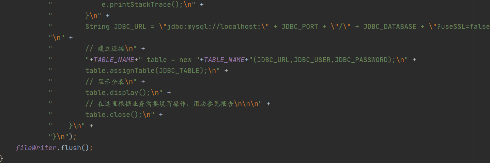

[TOC]

# Java数据库操作实验报告

### 实验任务描述

```
Java的数据库操作有三重境界：

1、直接数据库操作，数据库连接、SQL语句等。

2、对应数据库中的表建一个类，以类的方式隔离数据库操作。

3、对于任意指定的表自动生成相应的类的Java程序。实现基本的数据库查询、显示与增、删、改等常规操作。

本作业理论上应该有四~五个Java源程序：

1)对数据库的直接操作；建立连接、SQL语句等。

2)对指定表建一个类，以类的方式实现对数据库操作的隔离。

3)对于任意指定表可自动产生相应的类的程序[程序2)]。

4)1到2个对于不同的表，由3)产生的自动类实例。为其它程序员提供数据库编程的工具的程序。
```

### 实验整体思路

实验主要分为三部分

* 主程序直接使用原生sql语言进行操作
* 主程序新建管理类，为管理类定义数据库操作，主程序使用管理类操作数据库
* 主程序生成一个第二部分的文件

三部分首先都需要连接数据库。根据指定的数据表，展示数据内容。第一部分在“已经知道数据表结构”的基础上预先写定增删查改的操作；第二部分在“已经知道数据表结构”的基础上定义实现了系列增删查改的方法，并预先写定了一些方法以供示范；第三部分在“不知道数据表结构”的基础上实现了增删查改方法，可以根据用户指定的数据库表来直接生成基于数据表内容的增删查改方法。由于第三部分要求“为其他程序员提供编程工具”，所以仅预先写定打印数据表的操作，并没有修改内容。


### 设计要点、创新点

* 支持数据表的REAL、INT、BIGINT、CHAR、VARCHAR等类型（不含DATE|TIME）
* 条件筛选（对应WHERE子句）支持链式调用，并支持==与运算==和==或运算==
* 条件筛选==支持所有六种比较操作==（大于、小于、不大于、不小于、相等、不相等）
* 类名使用==`DB/TABLE/ROW_数据库名_数据表名`==的方式进行定义，确保同一工程下各类之间互不影响
* 类隔离操作时使用vector为每行记录保存对象，此后查询、更新、删除、插入操作均对vector进行


### 实验详细思路

#### 第一境界：BasicDBOPeration

使用java直接操作数据库流程比较简单，首先加载驱动并连接数据库。由于数据表结构已知，所以直接根据内容进行查询。


这里仅以查数据为例，增、删、改同理，只需要改动sql语句即可，此处略去。其中原始数据表如下所示


#### 第二境界：ClassDBOperation

ClassDBOperstion类主函数如下，和第一境界比较相似，区别在于对数据库的操作是调用了TableManager类的方法。


TableManager是自定义类，其私有变量及构造函数如下所示：


构造函数内实现对数据库的连接。连接成功后，主函数通过assignTable方法为TableManager加载表信息


执行条件操作时（即相当于sql中的where子句）首先需要调用startCondition填入第一个选择。系列选择函数包括startCondition、and、or，均支持链式调用。具体思路是使用indexList这一和vector等长的布尔数组来标记，true表示这一条记录会被选入结果集。startCondition先选中所有记录，然后调用and将不符合条件的记录置为false。由于and内部对选择属性值、操作、比较值都进行了switch判断，内容很长，此处略去，代码附在文末。

and方法核心思想：排除不满足条件的项；or方法核心思想：加入符合条件的项。由于startCondition、and、or方法实际上是在修改辅助布尔数组indexList，而且每次只判断一个条件，所以将返回值类型设定为TableManager以实现链式调用。


当选择结束后，可以调用show、update、remove方法来显示、更新、删除选定的记录。

以删除为例：首先新建临时Vector，并遍历vector，当对应的indexList项为真时表示该项被删除，则不做操作；否则将这一项添加到临时Vector中。最后将vector置为临时Vector，返回结果集的大小。


#### 第三境界：ClassDBCreator

此java文件编译运行后将根据指定的数据库、数据表，生成一个新的java文件，该java文件实现功能与境界二相同，为“以类操作数据库，实现隔离”提供了系列方法。总体逻辑如下：main函数中连接数据库，获取数据表信息，随后创建新的文件，并获得FileWriter。此后依次调用`genXXX`系列函数，使用FileWriter向文件写入各个函数的字符串，最后输出文件存放地点。


下面逐个对调用函数进行介绍：

init用于读取数据表的创建信息，并把字段名和字段类型映射到Java的类、保存到mapper中。mapper是ClassDBCreator类内的静态私有二维字符串数组。通过遍历该数组可以获取表所有字段的变量名和变量类型。


genMain用于向文件打印境界二的main函数。由于需要提供接口的功能，所以默认操作只有display方法，为显示全表信息。




genRow用于向文件写入记录类。vector中每个此类实例即为数据表中的一条记录。


genTableStart用于输出表的管理类。由于这个管理类内有很多方法，所以这里的Start是先输出类名一直到类内第一个函数之前的内容。后续需要对应的genTableEnd来结束类、关闭数据库连接。


genAssignTable用于生成一个填充vector的函数。


genDisplay用于生成显示全表的函数。


同理，其他gen开头的函数用于向文件写入对应的函数字符串，由于内容过长且与第二境界代码很大部分重复，此处略去，代码部分将放到附录中。


### 编译环境

* IDE

  ```
  IntelliJ IDEA 2020.2.3 (Ultimate Edition)
  Build #IU-202.7660.26, built on October 6, 2020
  Licensed to https://zhile.io
  You have a perpetual fallback license for this version
  Subscription is active until July 8, 2089
  Runtime version: 11.0.8+10-b944.34 amd64
  VM: OpenJDK 64-Bit Server VM by JetBrains s.r.o.
  Windows 10 10.0
  GC: ParNew, ConcurrentMarkSweep
  Memory: 1965M
  Cores: 8
  Registry: ide.suppress.double.click.handler=true
  Non-Bundled Plugins: Statistic, org.jetbrains.kotlin, com.intellij.plugins.html.instantEditing, com.jetbrains.php, Pythonid
  ```

* JAVA version 

  ```
  java version "1.8.0_271"
  Java(TM) SE Runtime Environment (build 1.8.0_271-b09)
  Java HotSpot(TM) 64-Bit Server VM (build 25.271-b09, mixed mode)
  ```

* OS

  ```
  Microsoft Window 10 家庭中文版
  基于x64的电脑
  ```

* MySQL

  ```
  mysql-5.7.31-winx64
  ```

  

### 主要文件及目录说明

```python
./
|-JavaDatabase/ #工程目录，此目录需直接在IDEA打开
|             |-.idea/*
|             |
|             |-out/
|             |    |-production/*
|             |
|             |-lib/
|             |    |-mysql-connector-java-5.1.47/* #驱动 需要手动导入项目lib库中
|             |
|             |-src/
|             |    |-BasicDBOperation.java #第一层境界 使用java直接操作数据库
|             |    |-ClassDBOperation.java #第二层境界 使用类实现数据库操作隔离
|             |    |-ClassDBCreator.java #第三层境界 根据指定的数据库与数据表生成一个第二层境界的java文件
|             |    |-DB_javadb_classes.java #第三层境界生成的一个实例
|             |    |-DB_javadb_students.java #第三层境界生成的一个实例
|             |
|             |-JavaDatabase.iml
|             |-initdatabase.sql #数据库、表初始化sql
```


### 运行说明

1. 为保证此实验能运行，如果本地没有MySQL5.7.31的环境，则需要下载并配置环境。由于Archive包的下载与配置并非本次实验的关键部分，所以我单独写了篇说明并发布在CSDN上：[链接](https://blog.csdn.net/weixin_43483799/article/details/111256190) 

2. 管理员身份启动cmd，输入`net start mysql`启动mysql服务，输入`mysql -uroot` 登陆，打开`initdatabase.sql`并将所有内容拷贝到cmd窗口中，多按几次回车确保全部执行结束，如下图所示

   

3. 使用Intellj打开`JavaDataBase`目录，手动导入`lib`目录下的`mysql-connector-java-5.1.47`目录

   

4. 此时BasicDBOperation.java、ClassDBOperation.java、ClassDBCreator.java均可直接使用Shift+Ctrl+F10编译运行。
5. 更换ClassDBCreator.java选择的数据表时，需要手动修改ClassDBCreator.java文件11-15行的变量赋值
6. 以类隔离的方法操作数据库的使用方法说明如下
   * table.display() 输出数据表信息
   * table.startCondition(attr, op, value) 进行where子句选择时首先需要调用startCondition，attr为指定字段的名称；op是定义的比较方式，有GREATER_THAN、NO_GREATER_THAN、LESS_THAN、NO_LESS_THAN、EQUAL、NOT_EQUAL六种；value表示比较的值
   * table.and(attr, op, value) 用于添加与运算条件，需要用在startCondition后，可以链式调用，参数用法与startCondition相同
   * table.or(attr, op, value) 用于添加或运算条件，需要用在startCondition后，可以链式调用，参数用法与startCondition相同
   * table.show()进行数据表查询。where子句最后使用show来表示sql语句结束
   * table.update(attr, value)进行数据更新。where子句最后使用update来表示sql语句结束
   * table.remove()进行数据删除。where子句最后使用remove来表示sql语句结束

### 实验结果

#### MySQL中查询初始数据


#### 第一境界：直接使用SQL操作数据库

直接编译运行BasicDBOperation，输出结果如下所示


#### 第二境界：使用类实现数据库隔离

执行以下操作（每进行一次操作，输出全表）：

```java
// 显示全表
tableManager.display();
// 增
tableManager.add(9,"Ranker",0,60); //添加一条记录
tableManager.display();
// 删
tableManager.startCondition("id",EQUAL,5).remove(); //删除第五条记录
tableManager.display();
// 查
tableManager.startCondition("score",GREATER_THAN,85).show(); //查询分数高于85的记录
// 改
tableManager.startCondition("name",EQUAL,"Rushmore").update("score",100); //将Rushmore的分数置为100
tableManager.display();
```

输出结果如下：

```java
id | name | gender | score
--------------------------
1  Aamot  1  83
2  Abadie  0  87
3  Eric  1  81
4  Heckenberg  0  82
5  Hedemann  1  73
6  Matsubara  1  65
7  Rushmore  1  99
8  Vecker  0  63


id | name | gender | score
--------------------------
1  Aamot  1  83
2  Abadie  0  87
3  Eric  1  81
4  Heckenberg  0  82
5  Hedemann  1  73
6  Matsubara  1  65
7  Rushmore  1  99
8  Vecker  0  63
9  Ranker  0  60


id | name | gender | score
--------------------------
1  Aamot  1  83
2  Abadie  0  87
3  Eric  1  81
4  Heckenberg  0  82
6  Matsubara  1  65
7  Rushmore  1  99
8  Vecker  0  63
9  Ranker  0  60


id | name | gender | score
--------------------------
2  Abadie  0  87
7  Rushmore  1  99


id | name | gender | score
--------------------------
1  Aamot  1  83
2  Abadie  0  87
3  Eric  1  81
4  Heckenberg  0  82
6  Matsubara  1  65
7  Rushmore  1  100
8  Vecker  0  63
9  Ranker  0  60
```

验证可见操作均正确

#### 第三境界：生成第二境界的文件

初始参数设定如下：


编译运行结果输出如下：


==将生成的java文件拷贝到工程目录src下==，可见其核心函数如下：


此处以条件查询为例，查询id大于4且score低于70的记录：

```java
table.startCondition("id",GREATER_THAN,4)
    .and("score",LESS_THAN,70)
    .show();
```


可见结果正确。

ps：Intellj可能无法识别拼接的sql语句而在界面上显示红色波浪线标注，不需理会，直接编译运行即可。


### 实验心得

本次实验本身难度并不大，只是配置环境、编写格式化输出的流程非常繁琐。在以隔离的方式操作数据库时使用vetor的方法为传统的java调用数据库提供了新的思路。虽然当时讲课的时候听起来觉得比较高效，但是实际操作时发现这样会极大提高条件选择的工作量。原先使用sql时直接传入完整的条件筛选字符串即可完成的查询，在这里非要拆解成startCondition、and、or三个函数，而且每个函数内部都有大量的遍历。

实验本身比较顺利，不过实现的要求也仅是作业要求的简单的增删查改，没有实现主键约束、外键约束、事务、过程、断言、视图等其他数据库的特性，还有进一步提高的空间。


